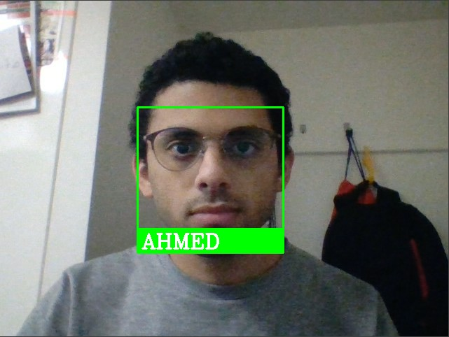

# FaceRecognition-AttendanceRecoder

### Thank you for looking into this project. 
## This is a face detection project.
## To use it all you need to do is to put images from your choice of the persons you want to detect in "ImagesAttendance" folder. 
## Then if you run "faceRecognition-attendaceProject.py" it will detect the face showing in the webcamera. 
## If you don't have a web camera, you can replace it with a photo of your choice.
## Here is a sample of the result

